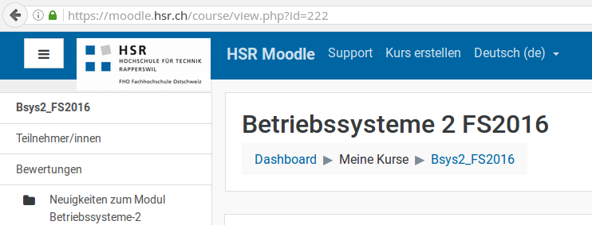

=====
Usage
=====

.. important::

    Kitovu addresses a primarily German-speaking audience, so we decided to write the following usage instructions in German first. An English translation will follow.

Verwendung über die Kommandozeile
---------------------------------

Du kannst kitovu sowohl mit einer grafischen Oberfläche verwenden als auch über die Kommandozeile. Bevor du kitovu verwenden kannst, musst du jedoch die Konfigurationsdatei erstellen, siehe weiter unten.

Die Kommandozeile bietet folgende Optionen:

    * ``kitovu --help`` zeigt alle verfügbaren Optionen an
    * ``kitovu [command] --help`` zeigt die für den spezifischen Befehl alle verfügbaren Optionen an
    * ``kitovu gui`` startet die grafische Oberfläche
    * ``kitovu sync`` startet die Synchronisation mit der von dir gewählten Konfiguration.
    * ``kitovu validate`` prüft, ob deine gewählte Konfiguration korrekt ist.
    * ``kitovu fileinfo`` sagt dir, wo kitovu zwei wichtige Dateien speichert, die Konfigurationsdatei und der FileCache.
    * ``kitovu edit`` öffnet die Konfigurationsdatei in einem Editor. Dieser kann mit ``--editor [EDITOR_NAME]`` oder über die Umgebungsvariable ``EDITOR`` angegeben werden. Ansonsten sucht kitovu nach einem gängigen Editor.
    * ``kitovu docs`` öffnet die Dokumentation von Kitovu in einem Webbrowser.

Verwendung der grafischen Oberfläche
------------------------------------

Unter "Konfiguration verwalten" stellst du ein, wo und wie kitovu Dateien synchronisiert. Wie die Konfiguration genau aufgebaut ist, liest du weiter unten.

Mit einem Klick auf "Dateien synchronisieren" lädst du alle benötigten Dateien herunter.

.. important::

    Dateien können sich zwischen zwei Synchronisationszeitpunkten ändern, etwa, weil du noch selber Notizen hinzugefügt hast. In diesem Fall werden sie beim derzeitigen Entwicklungsstandpunkt von kitovu mit der Server-Version überschrieben.

Konfiguration von kitovu
------------------------

Um überhaupt Dateien synchronisieren zu können, musst du zuerst festlegen, über welche Verbindungen das geschieht. Dies legst du in der Konfigurationsdatei fest. Je nach Betriebssystem liegt diese an einem anderen Ort. Du kannst diese Datei direkt mit ``kitovu edit`` bearbeiten. Alternativ siehst du, wo diese Datei gespeichert ist, indem du ``kitovu fileinfo`` auf der Kommandozeile eingibst. Die Datei kannst du in jedem beliebigen Texteditor konfigurieren.

.. important::

    Achte auf die korrekten Einrückungen, ansonsten ist die Konfiguration fehlerhaft!

So sieht eine Beispielkonfiguration aus:

.. code-block:: json

    root-dir: ~/kitovu
    connections:
      - name: skripte
        plugin: smb
        username: legger
      - name: moodleskripte
        plugin: moodle

    subjects:
      - name: EPJ
        sources:
          - connection: skripte
            remote-dir: Informatik/Fachbereich/Engineering-Projekt/EPJ
      - name: Betriebssysteme2
        sources:
          - connection: moodleskripte
            remote-dir: "Betriebssysteme 2 FS2016"

Es sind keine Leerzeichen in Namen erlaubt. Möchtest du Leerzeichen verwenden, etwa für ``name``, musst du den Namen in Gänsefüsschen setzen: ``Betriebssysteme2`` oder ``"Betriebssysteme 2"``.

Aufbau der Konfigurationsdatei
##############################

``root-dir``: Das Installationsverzeichnis von kitovu.

Abschnitt ``connections``
*************************

``connections``: Die Verbindungen zu den Plattformen, von denen du deine Unterrichtsmaterialien synchronisierst, in der Regel ist das ein SMB-Skripteserver oder Moodle.

``name``: Ein von dir frei wählbarer Name für die jeweilige Plattform.

``plugin``: Der Name der Plattform, der kitovu intern verwendet, damit eine Verbindung zustande kommt. Derzeit gibt es die fixen Bezeichnungen ``smb`` oder ``moodle``.

``username``: Dein Login-Name, womit du dich auch andernorts an der Schule einloggst, bestehend aus Vor- und Nachname. Moodle benötigt keinen Usernamen.

Abschnitt ``subjects``
**********************

``subjects`` bezeichnet die Unterrichtsmodule, die du an der Schule belegst, beispielsweise "Betriebssysteme 1" oder "Objektorientierte Programmierung in Java".

``name``: Ein von dir frei wählbarer Name für das jeweilige Unterrichtsmodul.

``sources``: Die Plattformen, von denen du die Unterrichtsmaterialien synchronisierst. Gewisse Unterrichtsmodule sind sowohl auf Moodle als auch auf dem Skripteserver zu finden - hier kannst du für jede Plattform einen separaten Eintrag erstellen.

``connection``: Der Name der Plattform, den du weiter oben unter ``connections`` bzw. dort als ``name`` festgelegt hast.

``remote-dir``: Das Verzeichnis, das synchronisiert werden soll. In Moodle entspricht dies dem Titel, den der Kurs im Browser trägt. Im folgenden Beispiel ist das "Betriebssysteme 2 FS2016":

Synchronisation
---------------

Bei der ersten Synchronsiation fragt dich kitvou nach allen benötigten Passwörtern. Für den Skripteserver ist dies das Passwort, das du für alle anderen Dienste an der Schule verwendest.

Moodle hingegen ist ein Spezialfall. Um dich erfolgreich mit Moodle verbinden zu können, fragt dich kitovu bei der Erstverwendung nach dem "Sicherheitsschlüssel". Den findest du folgendermassen:

    #. Logge dich via Browser auf Moodle ein.
    #. Navigiere zu den Einstellungen: klicke auf das Profilfoto oben rechts und wähle ``Einstellungen``, dann ``Sicherheitsschlüssel``.
    #. Kopiere den Eintrag unter "Schlüssel", der mit dem Servie "Moodle mobile web service" beschrieben wird. Das ist eine lange Kette von Zeichen und Zahlen. **Gib auf keinen Fall diesen Sicherheitsschlüssel weiter und behalte ihn für dich!**
    #. Füge den Sicherheitsschlüssel in kitovu ein, wenn dich das Programm danach fragt.

Der FileCache
-------------

Wenn du Dateien synchronisierst, hält kitovu das in einer Datei fest. Nach Ende eines Semesters bzw. nach Prüfungsende kannst du diese Datei wieder löschen - also wenn keines der Unterrichtsmodule des vergangenen Semesters mehr synchronisiert werden sollte. Du siehst, wo diese Datei gespeichert ist, indem du ``kitovu fileinfo`` auf der Kommandozeile eingibst.
